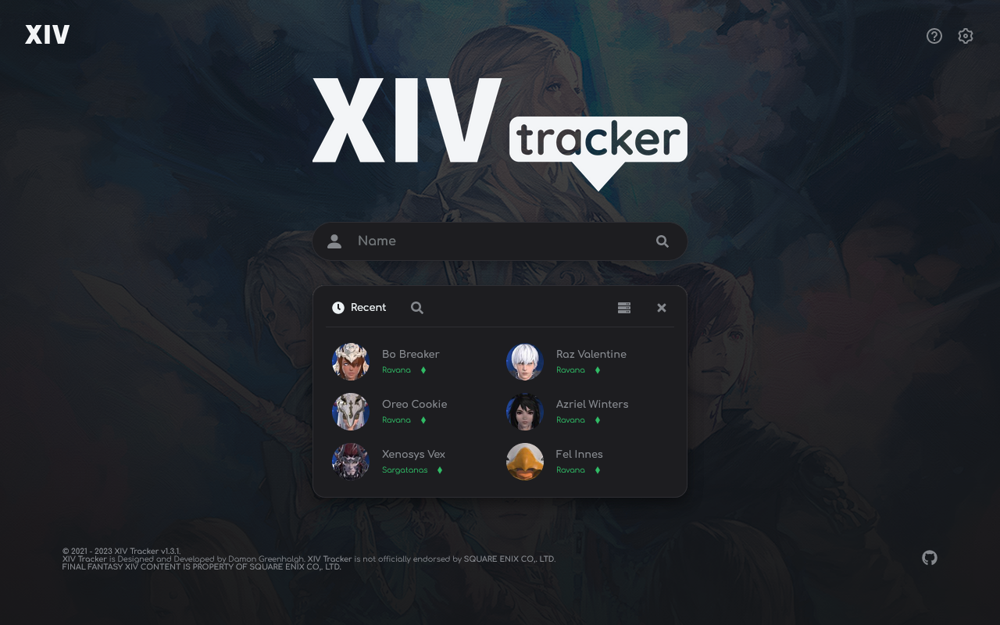
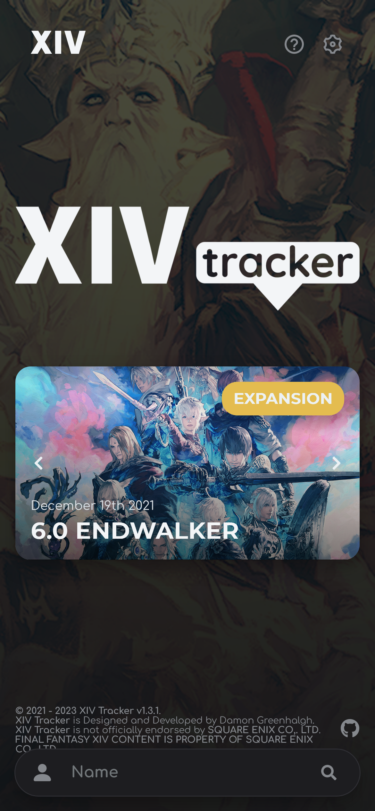
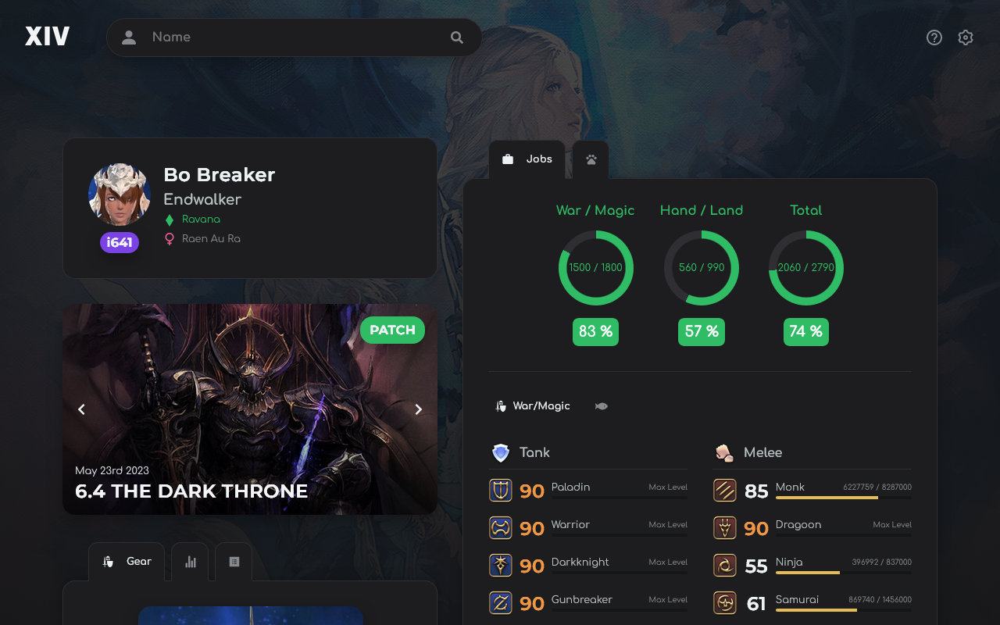
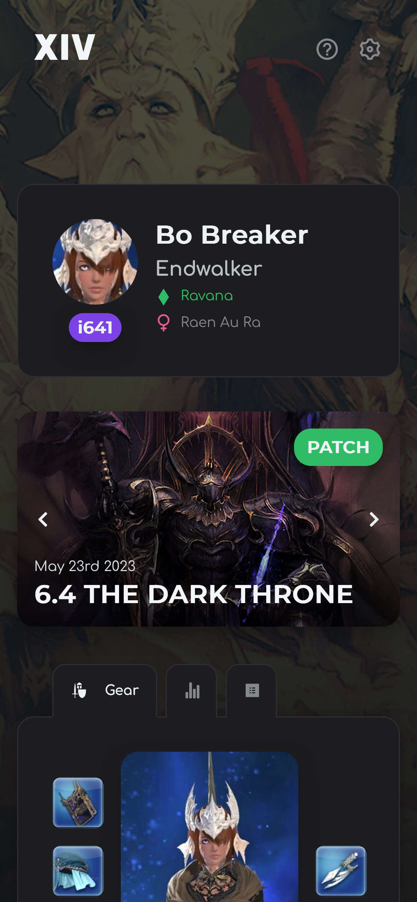
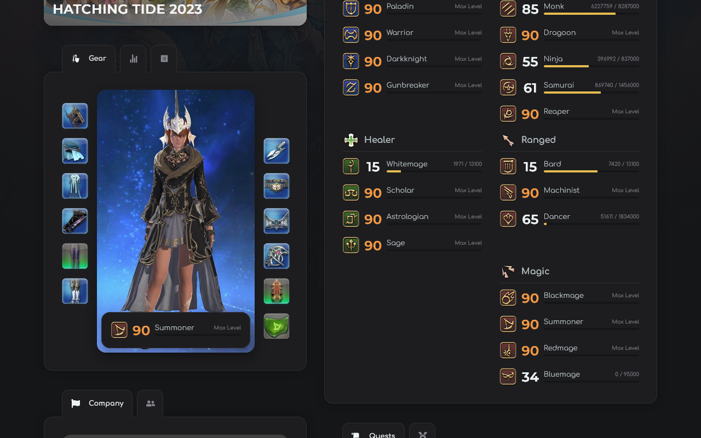
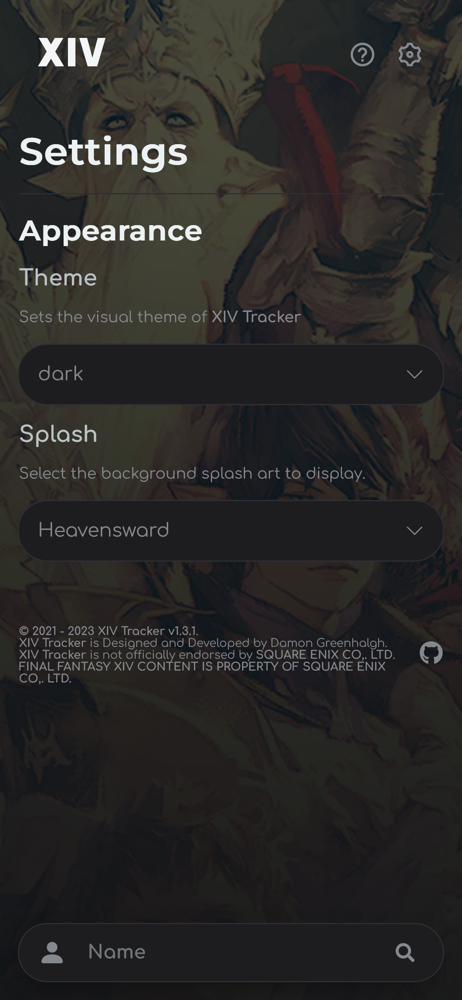

# XIV Tracker
  
[**XIV Tracker**](https://www.xivtracker.gg/) is a web application designed to help players keep track of their character's progress through the video game *Final Fantasy XIV*. **XIV Tracker** utilizes the community made [**XIVAPI**](https://xivapi.com/) for all its **API** requests. **FINAL FANTASY XIV CONTENT IS PROPERTY OF SQUARE ENIX CO,. LTD.**

## Features
Notable features of **XIV Tracker** include,

- **Global Search**: Every character; past and present; is available. No matter what server or data center they reside in.
- **Character Profile**: View basic information about a character (name, title, free company, grand company, attributes, etc).
- **Equipment**: View the current job and equipped gear, with tooltips that display *stats*, *glamour* and *materia* affixed to the item (if applicable).
- **Jobs**: View the current level and experience points of all jobs.
- **Collection**: View aquired mounts and minions.
- **Quests**: View all quests and encounters (*trials, dungeons and raids*), with indicators for completed activities.
- **Achievements**: View completed achievements.
- **Themes**: Supports dark and light themes.

## Screenshots 
Below are some previews of the app in both mobile and desktop resolutions. 

  
  
   
  
  
  

 

> Top left: desktop view of home page. Top right: Mobile view of home page.

> Bottom (from left to right): character page (desktop), character page (mobile), equipment and jobs (desktop), settings (mobile).

## License
**XIV Tracker** is released under the [**MIT license**](https://choosealicense.com/licenses/mit/).

## Disclaimer 
**XIV Tracker** is not affiliated with **SQUARE ENIX CO,. LTD**. **FINAL FANTASY XIV CONTENT IS PROPERTY OF SQUARE ENIX CO,. LTD.**
