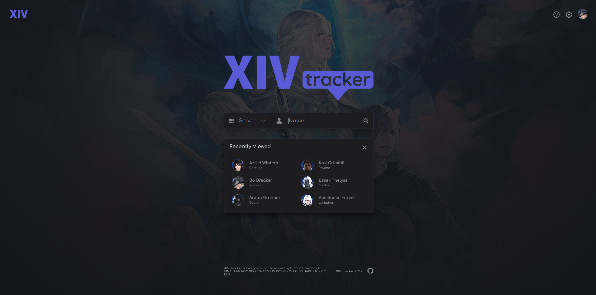
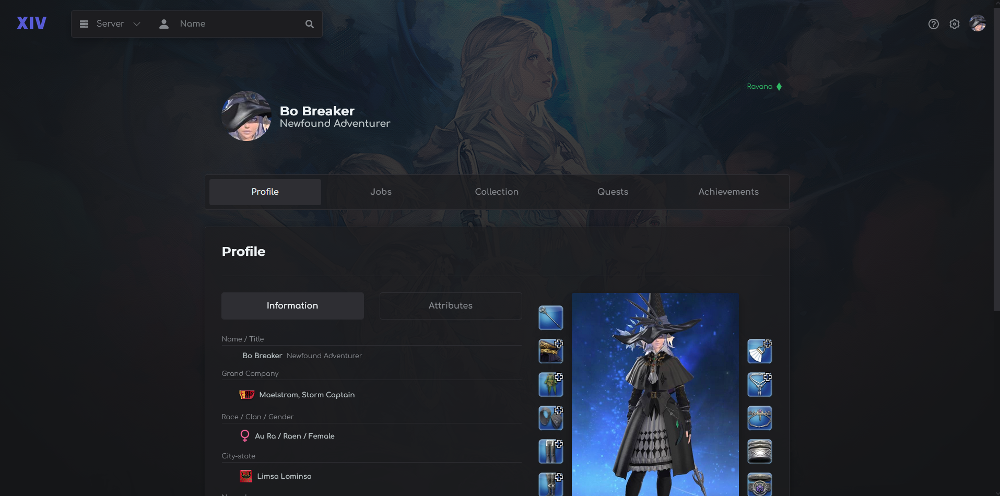
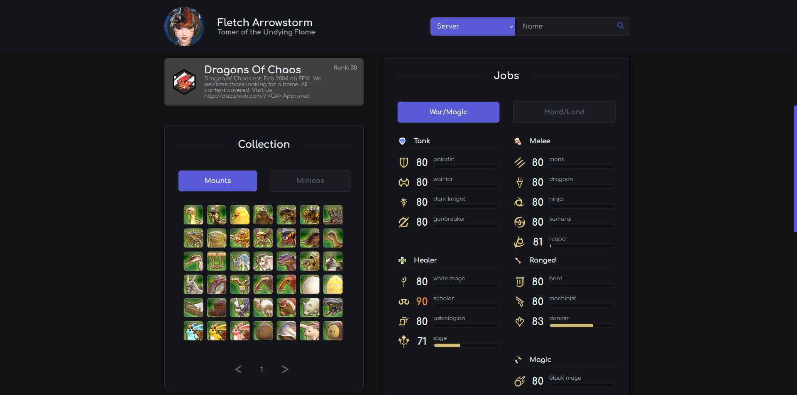
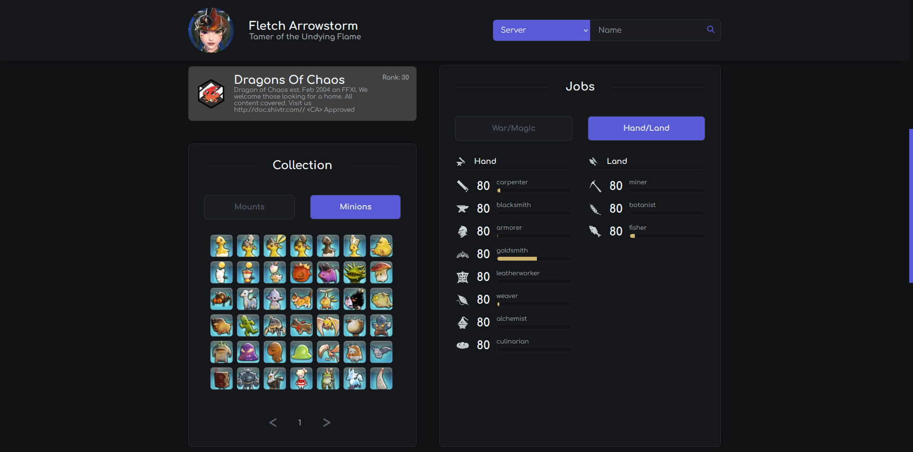
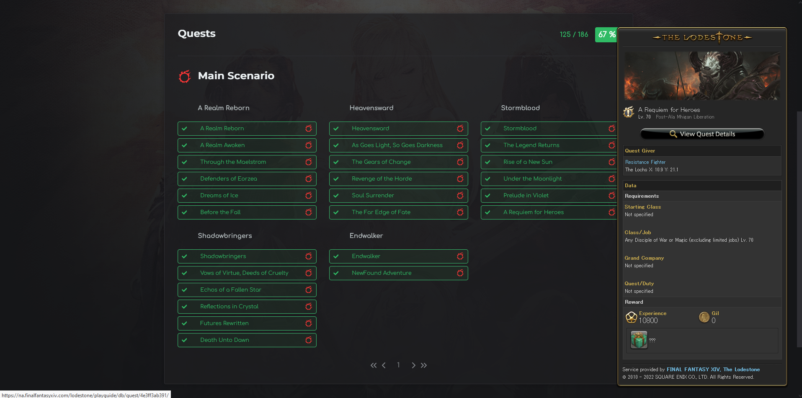

[***XIV Tracker***](https://damongreenhalgh.github.io/xivtracker) is a tool to help players keep track of their character progress through **Final Fantasy 14**. The web app utilizes the community made [***XIVAPI***](https://xivapi.com/) for all its **REST**ful requests. **FINAL FANTASY XIV CONTENT IS PROPERTY OF SQUARE ENIX CO,. LTD.**

## Features
Current features of the app include the following,

- Character Display
- Current Attributes
- Collection (Mounts and Minions)
- Jobs
- Quests and Encounter Completion
- Free Company

## Upcoming

- Better Tooltips
- Glamour
- Friends
- Free Company Page

## Screenshots

> Landing Page

> Character Page

> Eorzea Database Tooltips on quest and duty activities.

