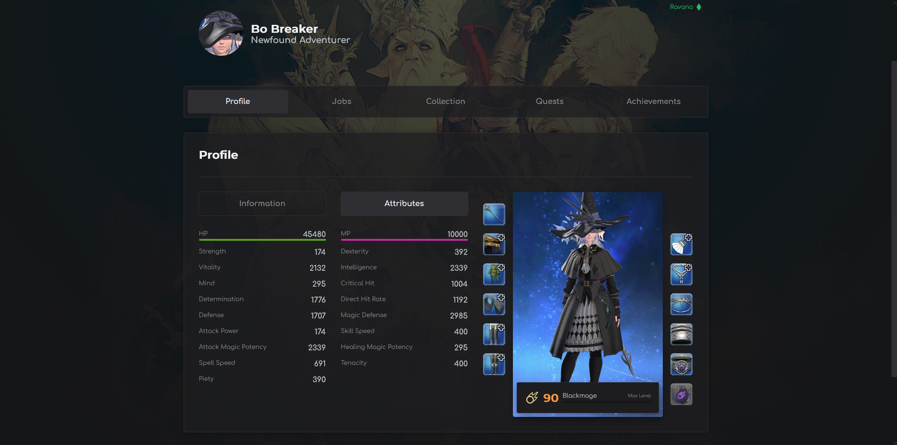
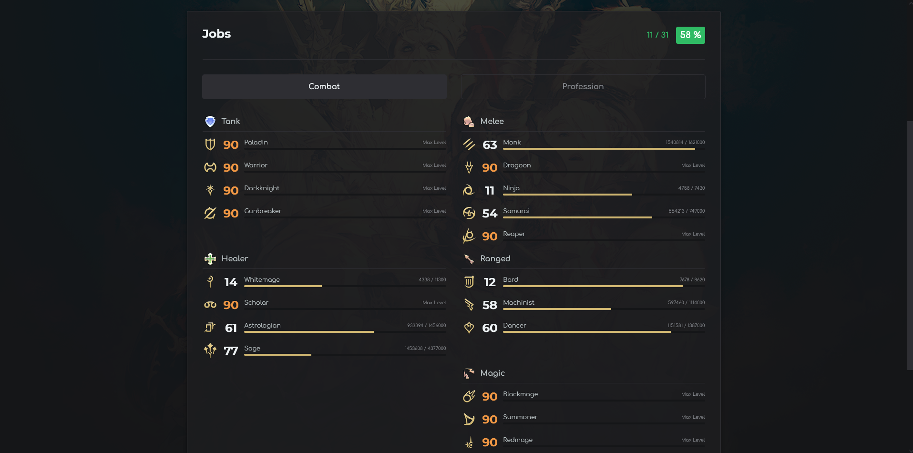
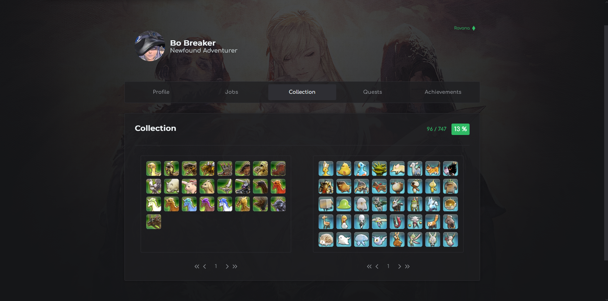
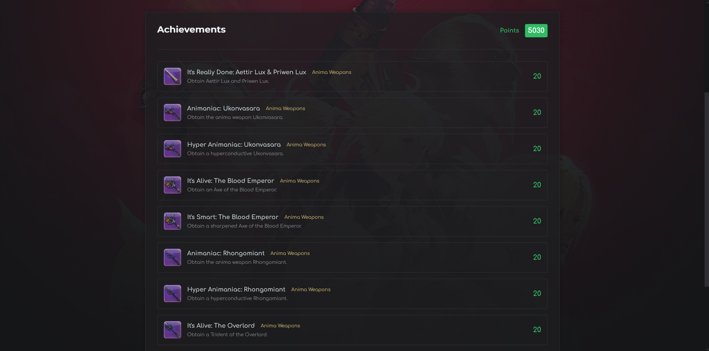
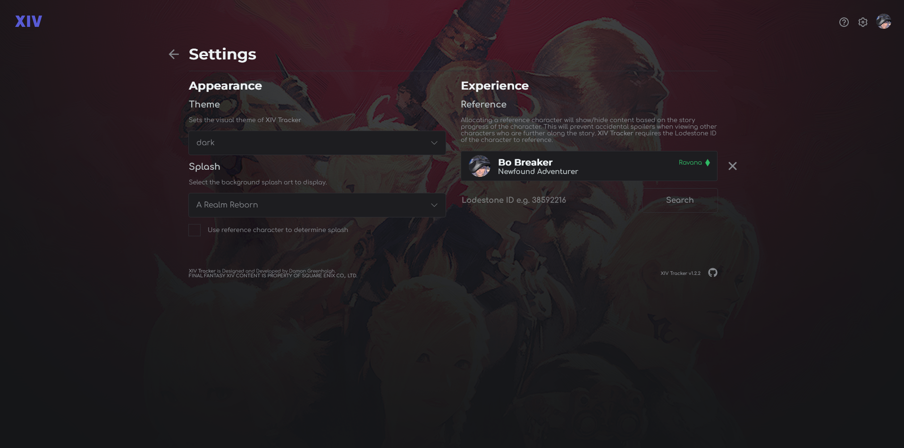
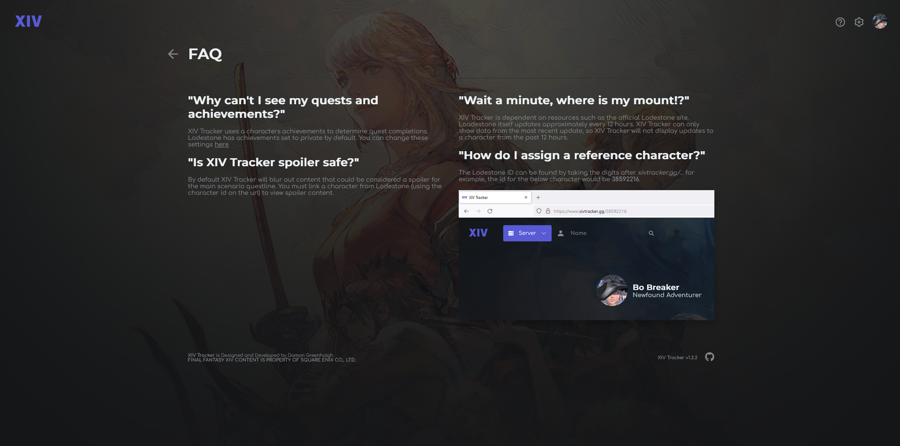

[**XIV Tracker**](https://www.xivtracker.gg/) is a web application designed to help players keep track of their character's progress through the critically acclaimed **MMORPG** *Final Fantasy XIV*. **XIV Tracker** utilizes the community made [**XIVAPI**](https://xivapi.com/) for all its **API** requests. **FINAL FANTASY XIV CONTENT IS PROPERTY OF SQUARE ENIX CO,. LTD.**

## Features
Notable features of **XIV Tracker** include,

- **Global Search**: Every character; past and present; is available. No matter what server or data center they reside in.
- **Character Profile**: View basic information about a character (name, title, free company, grand company, attributes, etc).
- **Equipment**: View the current job and equipped gear, with tooltips that display *stats*, *glamour* and *materia* affixed to the item (if applicable).
- **Jobs**: View the current level and experience points of all jobs; this includes jobs from the *disciple of war, magic, hand and land*.
- **Collection**: View aquired mounts and minions.
- **Quests**: View all quests and encounters (*trials, dungeons and raids*), with indicators for completed activities. Has [**EorzeaDB**](https://na.finalfantasyxiv.com/lodestone/playguide/db) tooltip integration.
- **Achievements**: View completed achievements.
- **Reference Character**: Allows users hide/show sensitive information based on the allocated reference character.
- **Themes**: Supports two themes, dark and light.
- **Dynamic Backgrounds**: Dynamically changes the background splash to reflect the current expansion most relevant to the reference character. 
- **FAQ**: Frequently Asked Questions (FAQ) and instructions to identify the Lodestone ID of a character. 
- **Completion Metric**: *Jobs, Collection, Quests* and *Achievements* all have an associated *completion* metric to indicate overall progress with respect to each aspect.

## Screenshots

> Home Page 

> General Information Panel 

> Attributes Panel 

 

> Jobs Panel 

 

> Collection Panel 

> Quests Panel

> Achievements Panel

> Settings Page

> FAQ Page

 

## License
**XIV Tracker** is released under the [**MIT license**](https://choosealicense.com/licenses/mit/).

## Disclaimer 

**XIV Tracker** is not affiliated with **SQUARE ENIX CO,. LTD**. **FINAL FANTASY XIV CONTENT IS PROPERTY OF SQUARE ENIX CO,. LTD.**
